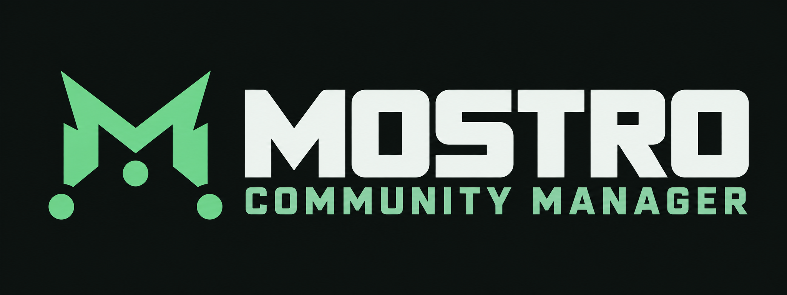

# Mostro Community Manager for Umbrel



Panel de operador para configurar una comunidad P2P sobre Mostro y Lightning, activar el daemon y supervisar órdenes, liquidez y mediación. **Versión del manifiesto de Umbrel: 1.0.11.**

## Instalar en Umbrel

Este repositorio también es una tienda comunitaria de una sola aplicación.

1. En Umbrel, abrir **App Store → Community App Stores / Tiendas comunitarias**.
2. Añadir `https://github.com/ManDeBitcoin/mostro-community-umbrel`.
3. Instalar **Mostro Community Manager**.
4. Comprobar que la ficha muestre **1.0.11** y abrirlo desde Umbrel.

ID estable de la aplicación: `mandebitcoin-mostro-manager`. Puerto del panel: `5173`, gestionado por `app_proxy`. No configurar un proxy público directo al contenedor. Datos exclusivos en `${APP_DATA_DIR}/data/config`.

El paquete está en [`mandebitcoin-mostro-manager/`](mandebitcoin-mostro-manager/); los archivos de la raíz son para desarrollo. Depende de la app Lightning de Umbrel y empaqueta el daemon oficial Mostro v0.19.0.

## Si ya tienes Mostro funcionando

Puedes conservar tu instalación. El Manager incluye su propio daemon Mostro, que permanece en espera hasta la activación, y no importa automáticamente la identidad ni la base de datos de una instancia externa. Antes de activar otra comunidad, comprueba identidad, red, LND, estado de operaciones y backups. Ver [convivencia y futura conexión](docs/coexistence.md).

## Incluye

- Panel React en español y API Rust/Axum.
- Configuración persistente de comunidad, mercado, seguridad, relays y métodos de pago, con validación y revisiones.
- Activación y desactivación del daemon Mostro oficial v0.19.0 a partir de la configuración guardada.
- Consulta de LND y panel de liquidez; monitor de órdenes públicas Nostr y simulador P2P.
- Consola de mediación, notificaciones en vivo y respaldos cifrados.

El [roadmap](docs/roadmap.md) conserva el historial y los siguientes pasos.

## Desarrollo local

Requisitos: Rust 1.94+, Node 22.13+ y npm. En dos terminales desde la raíz:

```sh
cargo run --locked -p mostro-community-api
```

```sh
npm --prefix web ci
npm --prefix web run dev
```

Abrir `http://127.0.0.1:5173`. Los datos locales se guardan en `var/config/`, ignorado por Git. `.env.example` documenta las variables opcionales; no se carga automáticamente. No se necesitan nodos ni claves para editar el borrador.

## Compilar y verificar

```sh
./scripts/check.sh
docker build -f docker/Dockerfile.umbrel -t mostro-community:preview .
./scripts/container-smoke.sh mostro-community:preview
```

El script de contenedor utiliza datos temporales; comprueba UI, CSP, guardado y persistencia tras reinicio. El workflow [`publish.yml`](.github/workflows/publish.yml) compila y prueba imágenes nativas amd64 y arm64 al publicar un tag `v*`. Solo después de verificar que GHCR las entrega sin credenciales promueve la nueva versión en la tienda. Ver el [proceso de publicación](docs/release-process.md) antes de crear un tag.

Las imágenes GHCR deben ser públicas para que Umbrel pueda descargarlas sin credenciales. La visibilidad del repositorio no convierte automáticamente sus paquetes en públicos.

[Arquitectura](docs/architecture.md) · [Validación](docs/validation.md) · [Identidad visual y dirección de interfaz](docs/brand-and-ui-direction.md) · [Blueprint original](docs/reference/blueprint-v4.md)

## Documentación operativa

[Resolver errores de Mostrix y discrepancias con el daemon](docs/mostrix-troubleshooting.md).

[Identidad y respaldos](docs/identity.md) · [LND de Umbrel](docs/lnd.md) · [Revisión previa de Mostro](docs/mostro-preflight.md) · [Convivencia con una instancia existente](docs/coexistence.md)
